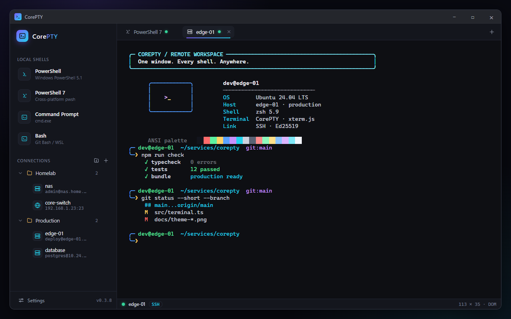
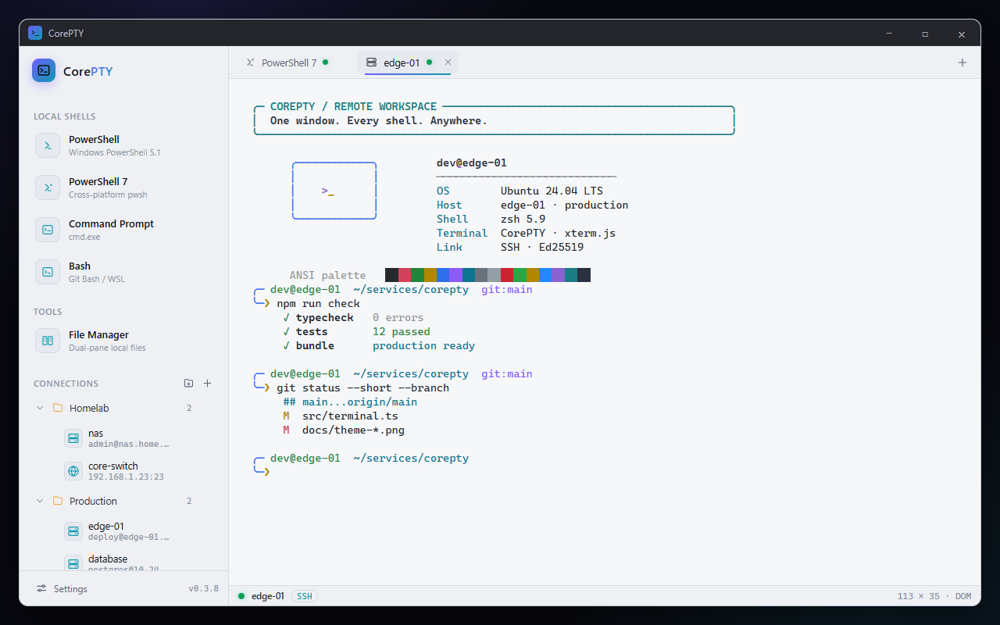
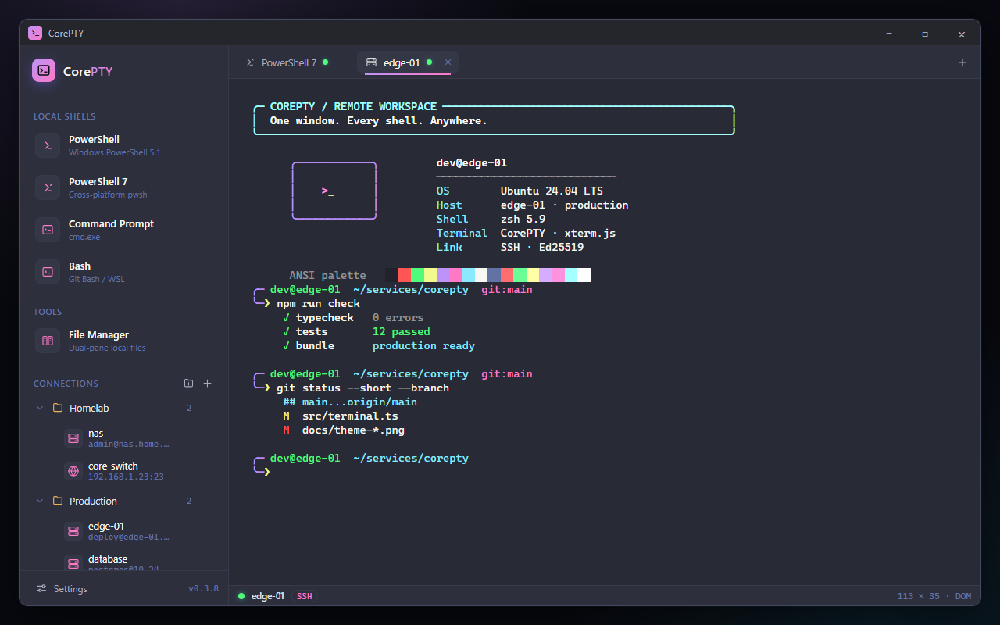
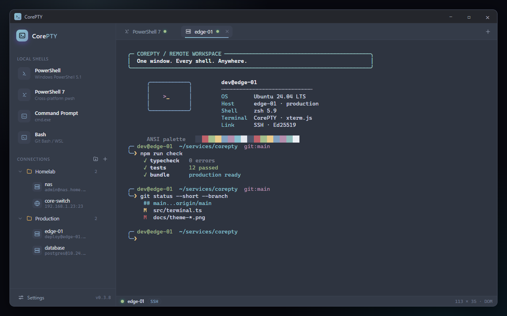
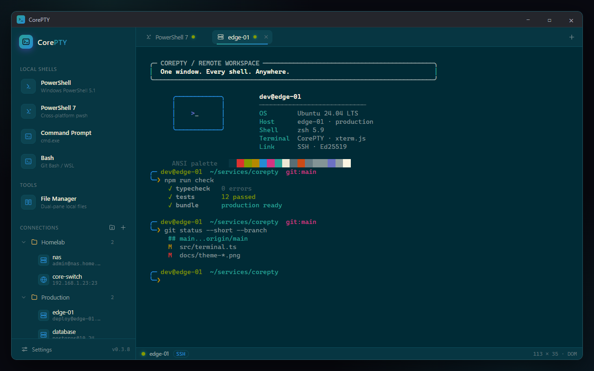
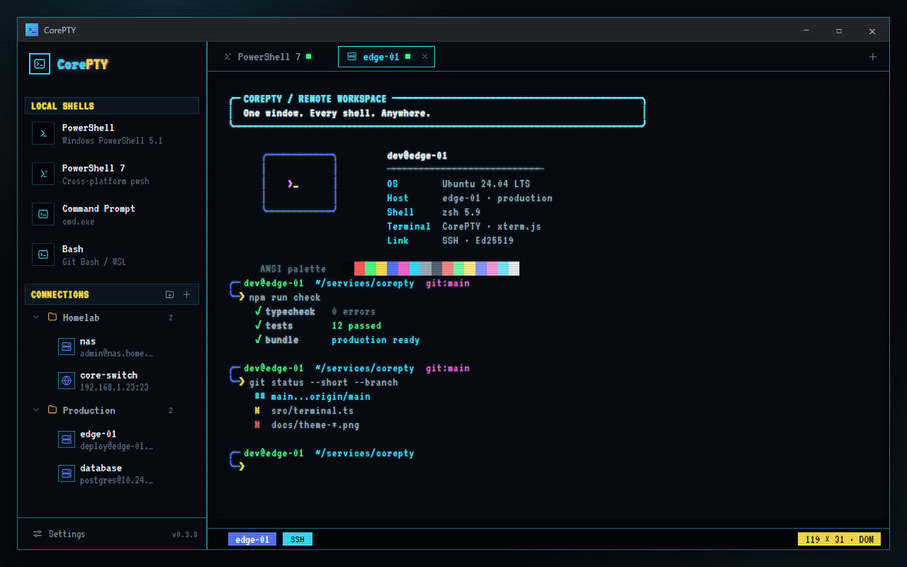
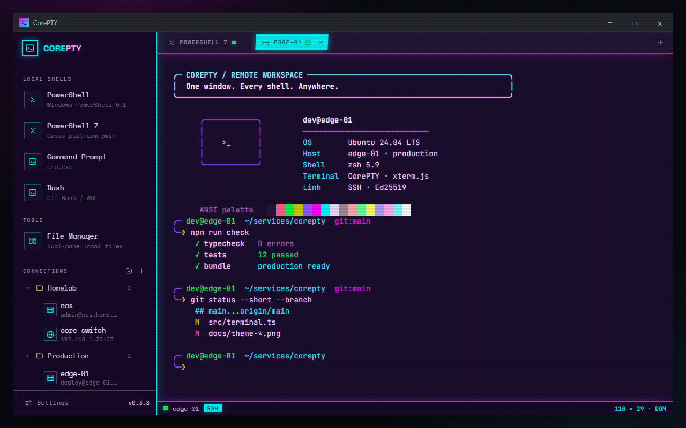
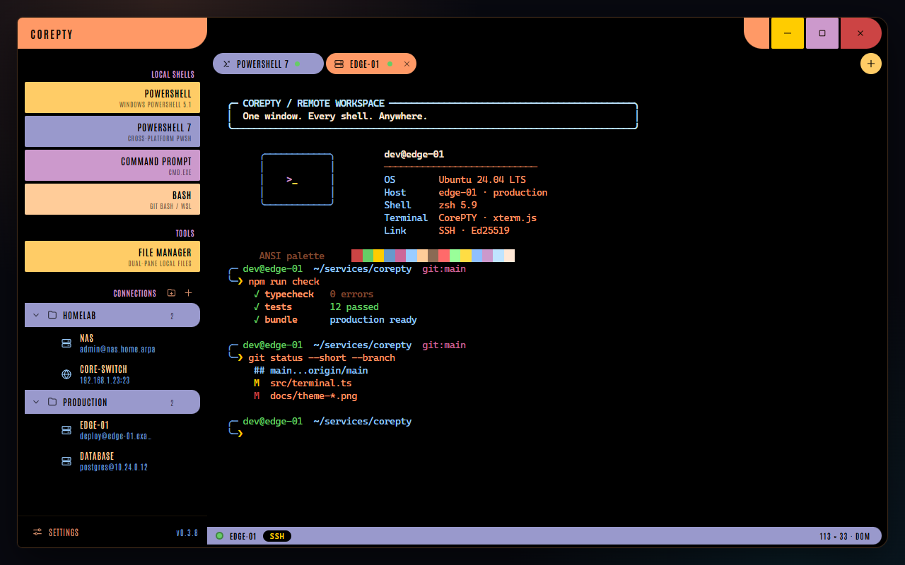

<div align="center">
  

  <h1>CorePTY</h1>

  <p><strong>A cross-platform terminal client for local shells, SSH, and Telnet.</strong></p>

  <p>
    <a href="https://github.com/daniel-leicht/CorePTY/actions/workflows/ci.yml"></a>
    <a href="https://github.com/daniel-leicht/CorePTY/actions/workflows/release.yml"></a>
    <a href="https://github.com/daniel-leicht/CorePTY/releases/latest"></a>
    <a href="LICENSE"></a>
    
  </p>

  
</div>

## Overview

CorePTY is a tabbed desktop terminal built with [Tauri 2](https://tauri.app/),
[xterm.js](https://xtermjs.org/), and Rust. It provides local pseudo-terminal
sessions, SSH connections, and Telnet connections in one interface without
bundling a Chromium runtime.

Connection profiles can be organized into nested folders. Saved passwords and
private-key passphrases are stored in the operating system keychain rather than
in the profile file.

## Features

- Local shells backed by native PTYs: ConPTY on Windows and `openpty` on macOS
  and Linux.
- SSH password authentication and Ed25519 or ECDSA private-key authentication
  through [`russh`](https://crates.io/crates/russh).
- SSH host-key verification using `~/.ssh/known_hosts`, with trust on first use.
- Telnet option negotiation for ECHO, SGA, terminal type, and window size.
- Windows administrator sessions through a UAC broker and restricted named
  pipes.
- Saved connections, nested folders, drag-and-drop organization, and custom
  connection colors.
- Dynamic terminal titles, tab duplication, reconnect support, search, and
  configurable right-click behavior.
- Eight built-in application and terminal themes.
- Configurable fonts, cursor styles, scrollback, bell behavior, minimum
  contrast, and copy-on-select.

## Downloads

Prebuilt packages are available from the
[latest GitHub release](https://github.com/daniel-leicht/CorePTY/releases/latest).

| Platform | Package | Notes |
|---|---|---|
| Windows 10/11 x64 | `CorePTY_<version>_x64-setup.exe` | NSIS installer; upgrades an existing per-user installation in place. |
| Windows x64 portable | `CorePTY_<version>_x64-portable.exe` | Standalone executable; requires the Microsoft Edge WebView2 runtime. |
| macOS universal | `CorePTY_<version>_universal.dmg` | Supports Intel and Apple Silicon. |
| Linux x86-64 | `CorePTY_<version>_amd64.AppImage` | Portable AppImage. Mark it executable before launching. |
| Debian or Ubuntu x86-64 | `CorePTY_<version>_amd64.deb` | Install with `sudo apt install ./CorePTY_<version>_amd64.deb`. |

Release artifacts are currently unsigned. Operating systems may therefore show
a security prompt on first launch.

## Security model

- Saved SSH passwords and key passphrases are held by Windows Credential
  Manager, macOS Keychain, or Linux Secret Service. They are not written to
  `sessions.toml`.
- A previously unknown SSH host key is accepted only if CorePTY can record it
  in `~/.ssh/known_hosts`. A changed key is rejected. Users should independently
  verify a new host's fingerprint when first connecting.
- RSA private keys and RSA-only servers are currently unsupported because the
  available Rust RSA implementation has an unresolved network-observable timing
  side channel. Use Ed25519 or ECDSA keys and host-key algorithms.
- Windows administrator tabs use an elevated broker connected through named
  pipes restricted to Administrators and SYSTEM. The main CorePTY process can
  send input to that elevated shell by design.
- Telnet provides no transport encryption or server authentication. Use it only
  with systems and networks where cleartext access is acceptable.

## Keyboard shortcuts

On macOS, use Command in place of Control for shortcuts that use `Ctrl`.

| Shortcut | Action |
|---|---|
| `Ctrl+Shift+T` | Open the default local shell |
| `Ctrl+Shift+N` | Open the connection dialog |
| `Ctrl+Shift+W` | Close the active tab |
| `Ctrl+Shift+R` | Reconnect the active session |
| `Ctrl+Shift+F` | Search the terminal buffer |
| `Ctrl+Shift+C` | Copy the current selection |
| `Ctrl+Shift+V` | Paste through the terminal input handler |
| `Ctrl+,` | Open settings |
| `Ctrl+Tab` | Select the next tab |
| `Ctrl+PageUp` / `Ctrl+PageDown` | Select the previous or next tab |
| Double-tap `Shift` | Open the tab switcher |
| Double-click a tab | Set a custom tab title |

## Themes

CorePTY includes CorePTY Dark, CorePTY Light, Dracula, Nord, Solarized Dark,
BBS, Synapse, and Starbase. A theme changes both the application interface and
the terminal palette.

<table>
  <tr>
    <td align="center" width="50%"><br /><strong>CorePTY Dark</strong></td>
    <td align="center" width="50%"><br /><strong>CorePTY Light</strong></td>
  </tr>
  <tr>
    <td align="center" width="50%"><br /><strong>Dracula</strong></td>
    <td align="center" width="50%"><br /><strong>Nord</strong></td>
  </tr>
  <tr>
    <td align="center" width="50%"><br /><strong>Solarized Dark</strong></td>
    <td align="center" width="50%"><br /><strong>BBS</strong></td>
  </tr>
  <tr>
    <td align="center" width="50%"><br /><strong>Synapse</strong></td>
    <td align="center" width="50%"><br /><strong>Starbase</strong></td>
  </tr>
</table>

## Architecture

| Area | Implementation |
|---|---|
| Desktop shell | Tauri 2 and each platform's native webview |
| Terminal renderer | xterm.js 6 with fit, search, Unicode, web-links, and WebGL addons |
| Local sessions | `portable-pty` |
| SSH | `russh` with the `ring` cryptography backend |
| Telnet | CorePTY's bounded IAC parser over Tokio TCP |
| Credentials | `keyring` with native platform backends |
| Profiles and settings | Atomically replaced TOML and JSON files in the application config directory |

The frontend and native session drivers communicate through Tauri commands and
binary-safe events. Local, SSH, Telnet, and elevated sessions share one lifecycle
and input abstraction.

## Build from source

### Prerequisites

All platforms require:

- Node.js 20 or later.
- Rust stable.
- The platform prerequisites listed in the
  [Tauri documentation](https://v2.tauri.app/start/prerequisites/).

Additional platform requirements:

- Windows: the MSVC Rust toolchain, Visual Studio 2022 Build Tools with the
  Desktop development with C++ workload, a Windows SDK, and WebView2.
- macOS: Xcode Command Line Tools.
- Debian or Ubuntu:

  ```bash
  sudo apt-get update
  sudo apt-get install -y \
    build-essential file libayatana-appindicator3-dev libdbus-1-dev \
    libgtk-3-dev librsvg2-dev libssl-dev libwebkit2gtk-4.1-dev \
    patchelf pkg-config wget
  ```

### Development

Install the locked frontend dependencies and start Tauri in development mode:

```bash
npm ci
npm run tauri dev
```

### Quality checks

Run the same frontend and native checks used by continuous integration:

```bash
npm run check

cd src-tauri
cargo fmt --all -- --check
cargo clippy --all-targets -- -D warnings
cargo test --all-targets
```

`npm run check` performs TypeScript type checking, runs the Vitest suite, and
produces a release-mode frontend bundle.

Regenerate the README's deterministic theme gallery on Windows with
`npm run screenshots`.

### Release build

From the repository root:

```bash
npm run tauri build
```

Tauri writes native binaries and installers under `src-tauri/target/release`.
The exact bundle directory depends on the operating system and selected target.

## Release process

The versions in `package.json`, `src-tauri/Cargo.toml`, and
`src-tauri/tauri.conf.json` must match. Push a corresponding version tag to run
the cross-platform release workflow:

```bash
git tag v<version>
git push origin v<version>
```

The workflow validates the versions, runs the automated checks, builds each
platform package, and publishes one GitHub release containing the resulting
artifacts.

## License

CorePTY is licensed under the
[GNU General Public License v3.0 or later](LICENSE).
